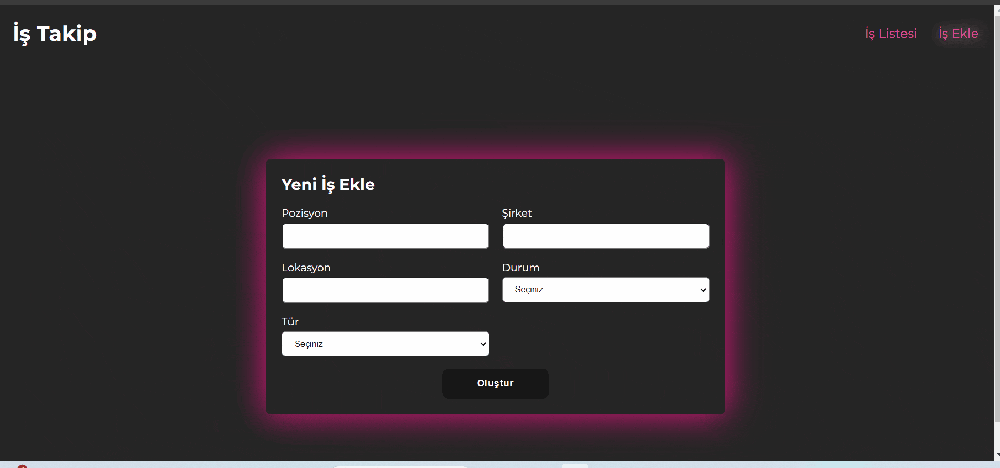

# Job App Toolkit

- This project includes a job application application developed using Redux Toolkit.
- Easy and fast installation is provided with `ConfigureStore`.
- Thanks to `CreateSlice`, action and reducer definitions have been made with simple and compact codes.
- Components can access state with selectors.

### Libraries:

    - `react-router-dom`,
    - `axios`, `json-server`,
    - `react-toastify`,
    - `react-redux`,
    - `@reduxjs/toolkit`,
    - `uuid`,
    - `react-icons`,
    - `sass`.

### Project gif

